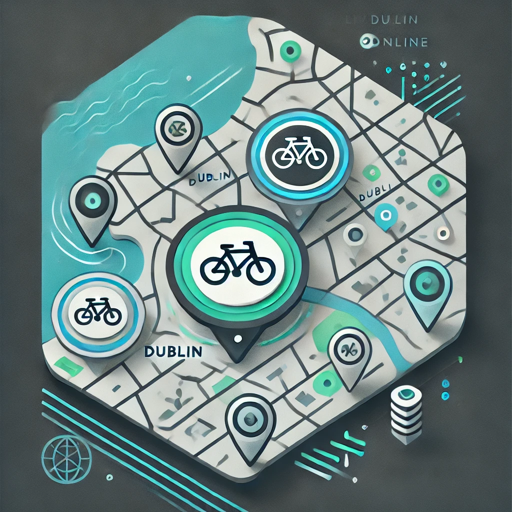

<!-- PROJECT SHIELDS -->
<!--
*** I'm using markdown "reference style" links for readability.
*** Reference links are enclosed in brackets [ ] instead of parentheses ( ).
*** See the bottom of this document for the declaration of the reference variables
*** for contributors-url, forks-url, etc. This is an optional, concise syntax you may use.
*** https://www.markdownguide.org/basic-syntax/#reference-style-links
-->
[![Contributors][contributors-shield]][contributors-url]
[![Forks][forks-shield]][forks-url]
[![Stargazers][stars-shield]][stars-url]
[![Issues][issues-shield]][issues-url]
[![MIT License][license-shield]][license-url]
[![LinkedIn][linkedin-shield]][linkedin-url]


<!-- PROJECT LOGO -->
<br />
<div align="center">
  <a href="https://github.com/iamstace/DublinBikes">
    
  </a>

<h3 align="center">ESRI ArcGIS Online Map Creation</h3>

  <p align="center">
    This Python script automates the process of fetching real-time GeoJSON data for Dublin Bikes, publishing it as a Feature Layer on ArcGIS Online (AGOL), and integrating it into an interactive map for visualization. The script streamlines the entire workflow, from retrieving live bike location data to creating a dynamic map that showcases current bike availability across Dublin. This tool is ideal for monitoring Dublin's bike-sharing system and visualizing key data points on AGOL with ease.
    
The markdown file with run through your environment setup, allowing you to pull and run/update the code as needed.
    <br />
    <a href="https://github.com/iamstace/DublinBikes"><strong>Explore the docs »</strong></a>
    <br />
    <br />
    <a href="https://github.com/iamstace/DublinBikes">View Demo</a>
    ·
    <a href="https://github.com/iamstace/DublinBikes/issues/new?labels=bug&template=bug-report---.md">Report Bug</a>
    ·
    <a href="https://github.com/iamstace/DublinBikes/issues/new?labels=enhancement&template=feature-request---.md">Request Feature</a>
  </p>
</div>


<!-- TABLE OF CONTENTS -->
<details>
  <summary>Table of Contents</summary>
  <ol>
    <li>
      <a href="#about-the-project">About The Project</a>
      <ul>
        <li><a href="#built-with">Built With</a></li>
      </ul>
    </li>
    <li>
      <a href="#getting-started">Getting Started</a>
      <ul>
        <li><a href="#prerequisites">Prerequisites</a></li>
        <li><a href="#installation">Installation</a></li>
      </ul>
    </li>
    <li><a href="#usage">Usage</a></li>
    <li><a href="#roadmap">Roadmap</a></li>
    <li><a href="#contributing">Contributing</a></li>
    <li><a href="#license">License</a></li>
    <li><a href="#contact">Contact</a></li>
    <li><a href="#acknowledgments">Acknowledgments</a></li>
  </ol>
</details>


<!-- ABOUT THE PROJECT -->
## About The Project

 This Python script automates the process of fetching real-time GeoJSON data for Dublin Bikes, publishing it as a Feature Layer on ArcGIS Online (AGOL), and integrating it into an interactive map for visualization. The script streamlines the entire workflow, from retrieving live bike location data to creating a dynamic map that showcases current bike availability across Dublin. This tool is ideal for monitoring Dublin's bike-sharing system and visualizing key data points on AGOL with ease.
    
The markdown file with run through your environment setup, allowing you to pull and run/update the code as needed.

<p align="right">(<a href="#readme-top">back to top</a>)</p>


### Built With

* [![Next][Next.js]][Next-url]
* [![ESRI][Esri]][Esri-url]
* [![React][React.js]][React-url]
* [![Vue][Vue.js]][Vue-url]
* [![Angular][Angular.io]][Angular-url]
* [![Svelte][Svelte.dev]][Svelte-url]
* [![Laravel][Laravel.com]][Laravel-url]
* [![Bootstrap][Bootstrap.com]][Bootstrap-url]
* [![JQuery][JQuery.com]][JQuery-url]

<p align="right">(<a href="#readme-top">back to top</a>)</p>


<!-- GETTING STARTED -->
## Getting Started

The following steps will allow you to set up the environment locally so you can work with the script provided.

### Prerequisites

Before running the script, ensure that you have the following prerequisites in place:
1. ArcGIS Online (AGOL) Account
   * Sign Up: If you don't already have an AGOL account, you will need to create one. Visit [ArcGIS Online](https://www.arcgis.com/sharing/rest/oauth2/signup?client_id=arcgisonline&redirect_uri=http://www.arcgis.com&response_type=token) to sign up for an account: .
   * Organization Access: If you are using an existing account ensure that your account has the necessary privileges to publish Feature Layers and create web maps. If you're part of an organisation, check with your administrator to ensure you have the correct permissions.
2. Github Account
   * Sign Up: If you do not have a GitHub account, you can [sign up for one](https://github.com/). 

    
### Setup and usage
1. 
1. Get a free API Key at [https://example.com](https://example.com)
2. Clone the repo
   ```sh
   git clone https://github.com/iamstace/DublinBikes.git
   ```
3. Install NPM packages
   ```sh
   npm install
   ```
4. Enter your API in `config.js`
   ```js
   const API_KEY = 'ENTER YOUR API';
   ```

<p align="right">(<a href="#readme-top">back to top</a>)</p>


<!-- USAGE EXAMPLES -->
## Usage

Use this space to show useful examples of how a project can be used. Additional screenshots, code examples and demos work well in this space. You may also link to more resources.

_For more examples, please refer to the [Documentation](https://example.com)_

<p align="right">(<a href="#readme-top">back to top</a>)</p>


<!-- ROADMAP -->
## Roadmap

- [ ] Feature 1
- [ ] Feature 2
- [ ] Feature 3
    - [ ] Nested Feature

See the [open issues](https://github.com/iamstace/DublinBikes/issues) for a full list of proposed features (and known issues).

<p align="right">(<a href="#readme-top">back to top</a>)</p>


<!-- CONTRIBUTING -->
## Contributing

Contributions are what make the open source community such an amazing place to learn, inspire, and create. Any contributions you make are **greatly appreciated**.

If you have a suggestion that would make this better, please fork the repo and create a pull request. You can also simply open an issue with the tag "enhancement".
Don't forget to give the project a star! Thanks again!

1. Fork the Project
2. Create your Feature Branch (`git checkout -b feature/AmazingFeature`)
3. Commit your Changes (`git commit -m 'Add some AmazingFeature'`)
4. Push to the Branch (`git push origin feature/AmazingFeature`)
5. Open a Pull Request

<p align="right">(<a href="#readme-top">back to top</a>)</p>


<!-- LICENSE -->
## License

Distributed under the MIT License. See `LICENSE.txt` for more information.

<p align="right">(<a href="#readme-top">back to top</a>)</p>


<!-- CONTACT -->
## Contact

Your Name - vernon-s3@ulster.ac.uk

Project Link: [https://github.com/iamstace/DublinBikes](https://github.com/iamstace/DublinBikes)

<p align="right">(<a href="#readme-top">back to top</a>)</p>


<!-- ACKNOWLEDGMENTS -->
## Acknowledgments

* []()
* []()
* []()

<p align="right">(<a href="#readme-top">back to top</a>)</p>


<!-- MARKDOWN LINKS & IMAGES -->
<!-- https://www.markdownguide.org/basic-syntax/#reference-style-links -->
[Esri-url]: https://www.esri.com/en-us/home
[Esri]: https://en.wikipedia.org/wiki/Esri#/media/File:Esri_logo.svg
[contributors-shield]: https://img.shields.io/github/contributors/iamstace/DublinBikes.svg?style=for-the-badge
[contributors-url]: https://github.com/iamstace/DublinBikes/graphs/contributors
[forks-shield]: https://img.shields.io/github/forks/iamstace/DublinBikes.svg?style=for-the-badge
[forks-url]: https://github.com/iamstace/DublinBikes/network/members
[stars-shield]: https://img.shields.io/github/stars/iamstace/DublinBikes.svg?style=for-the-badge
[stars-url]: https://github.com/iamstace/DublinBikes/stargazers
[issues-shield]: https://img.shields.io/github/issues/iamstace/DublinBikes.svg?style=for-the-badge
[issues-url]: https://github.com/iamstace/DublinBikes/issues
[license-shield]: https://img.shields.io/github/license/iamstace/DublinBikes.svg?style=for-the-badge
[license-url]: https://github.com/iamstace/DublinBikes/blob/master/LICENSE.txt
[linkedin-shield]: https://img.shields.io/badge/-LinkedIn-black.svg?style=for-the-badge&logo=linkedin&colorB=555
[linkedin-url]: https://linkedin.com/in/linkedin_username
[product-screenshot]: images/screenshot.png
[Next.js]: https://img.shields.io/badge/next.js-000000?style=for-the-badge&logo=nextdotjs&logoColor=white
[Next-url]: https://nextjs.org/
[React.js]: https://img.shields.io/badge/React-20232A?style=for-the-badge&logo=react&logoColor=61DAFB
[React-url]: https://reactjs.org/
[Vue.js]: https://img.shields.io/badge/Vue.js-35495E?style=for-the-badge&logo=vuedotjs&logoColor=4FC08D
[Vue-url]: https://vuejs.org/
[Angular.io]: https://img.shields.io/badge/Angular-DD0031?style=for-the-badge&logo=angular&logoColor=white
[Angular-url]: https://angular.io/
[Svelte.dev]: https://img.shields.io/badge/Svelte-4A4A55?style=for-the-badge&logo=svelte&logoColor=FF3E00
[Svelte-url]: https://svelte.dev/
[Laravel.com]: https://img.shields.io/badge/Laravel-FF2D20?style=for-the-badge&logo=laravel&logoColor=white
[Laravel-url]: https://laravel.com
[Bootstrap.com]: https://img.shields.io/badge/Bootstrap-563D7C?style=for-the-badge&logo=bootstrap&logoColor=white
[Bootstrap-url]: https://getbootstrap.com
[JQuery.com]: https://img.shields.io/badge/jQuery-0769AD?style=for-the-badge&logo=jquery&logoColor=white
[JQuery-url]: https://jquery.com 
