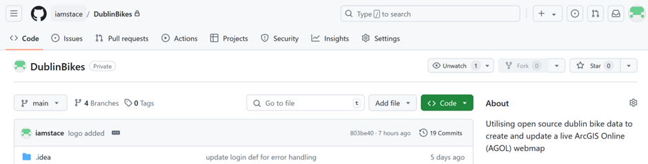
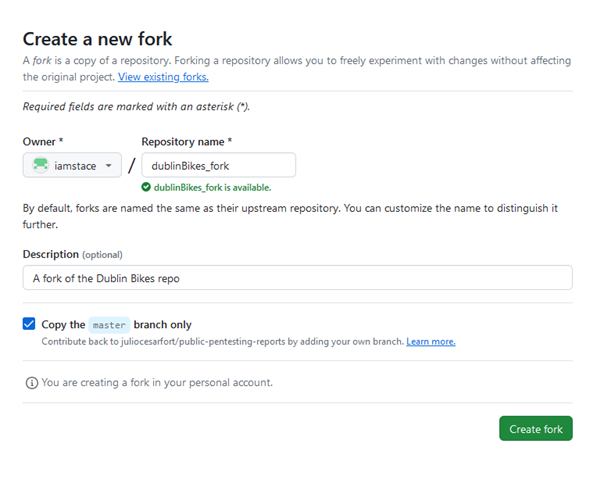
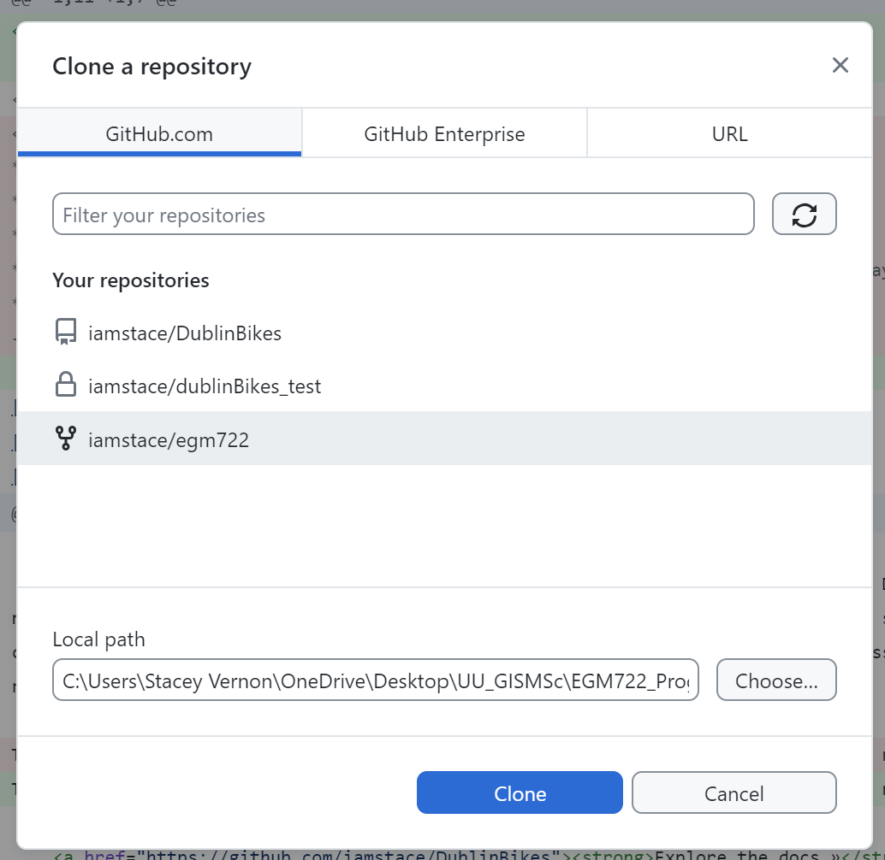
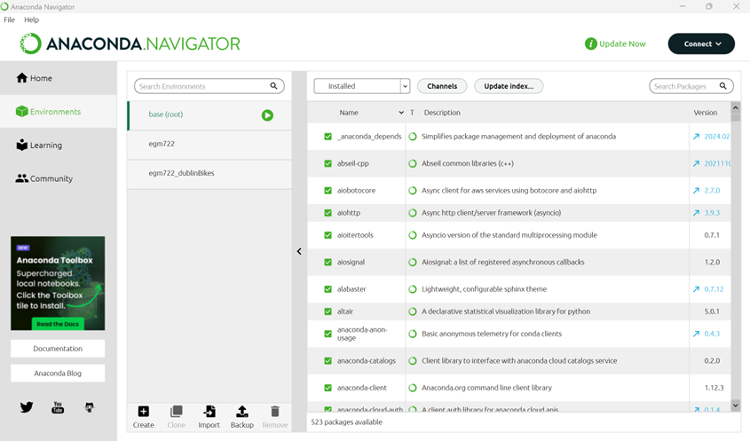
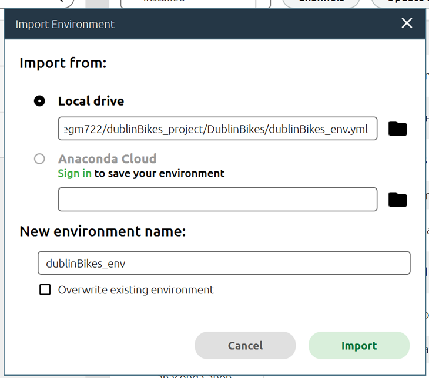
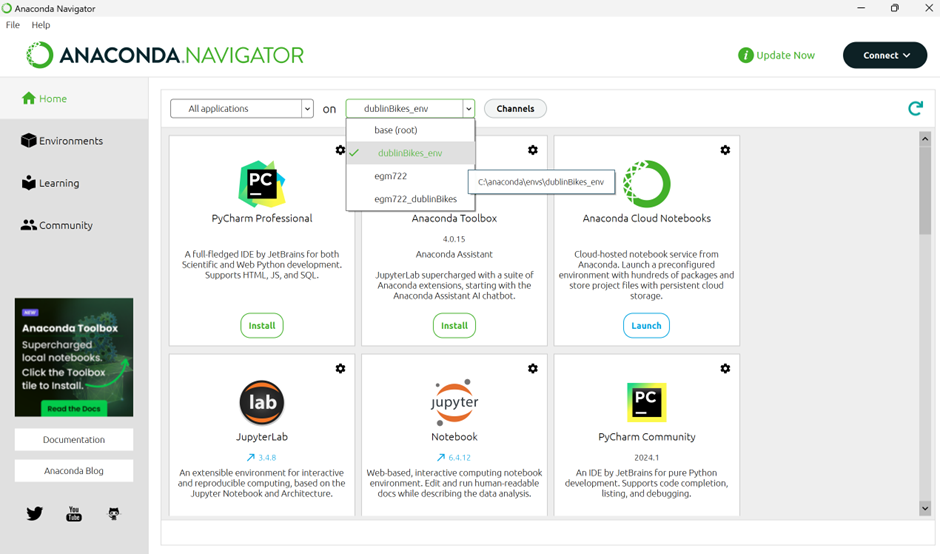

<!-- PROJECT SHIELDS -->

[![Contributors][contributors-shield]][contributors-url]
[![Forks][forks-shield]][forks-url]
[![Stargazers][stars-shield]][stars-url]
[![Issues][issues-shield]][issues-url]
[![MIT License][license-shield]][license-url]
[![LinkedIn][linkedin-shield]][linkedin-url]

<!-- PROJECT LOGO -->
 

  

<h3 align="center">ESRI ArcGIS Online Map Creation</h3>

  

   TL;DR: Clone the repo, set up your environment with the provided dublinBikes_env.yml, and run the script to see live Dublin bike data on your AGOL map in minutes!
     
    <a href="https://github.com/iamstace/DublinBikes"><strong>Explore the docs »</strong></a>
     
     
    <a href="https://github.com/iamstace/DublinBikes/issues/new?labels=bug&template=bug-report---.md">Report Bug</a>
    ·
    <a href="https://github.com/iamstace/DublinBikes/issues/new?labels=enhancement&template=feature-request---.md">Request Feature</a>
  

<!-- TABLE OF CONTENTS -->

  
Table of Contents

  <ol>
    <li>
      <a href="#about-the-project">About The Project</a>
    </li>
    <li>
      <a href="#getting-started">Getting Started</a>
      <ul>
        <li><a href="#prerequisites">Prerequisities</a></li>
        <li><a href="#setup">Setup</a></li>
      </ul>
    </li>
    <li><a href="#roadmap">Roadmap</a></li>
    <li><a href="#contributing">Contributing</a></li>
    <li><a href="#license">License</a></li>
    <li><a href="#contact">Contact</a></li>
    <li><a href="#acknowledgments">Acknowledgments</a></li>
  </ol>

<!-- ABOUT THE PROJECT -->
## About The Project

 This Python script automates the process of fetching real-time GeoJSON data for Dublin Bikes, publishing it as a Feature Layer on ArcGIS Online (AGOL), and integrating it into an interactive map for visualisation. The script streamlines the entire workflow, from retrieving live bike location data to creating a dynamic map that showcases current bike availability across Dublin. This tool is ideal for monitoring Dublin's bike-sharing system and visualising key data points on AGOL with ease.
    
The markdown file with run through your environment setup, allowing you to pull and run/update the code as needed.

(<a href="#readme-top">back to top</a>)

### Built With

* [![Python][Python]][Python-url]
* [![ESRI][Esri]][Esri-url]
* [![GitHub][GitHub]][GitHub-url]

(<a href="#readme-top">back to top</a>)

<!-- GETTING STARTED -->
## Getting Started

The following steps will allow you to set up the environment locally so you can work with the script provided.

### Prerequisites

Before running the script, ensure that you have the following prerequisites in place:
1. ArcGIS Online (AGOL) Account
   * Sign Up: If you don't already have an AGOL account, you will need to create one. Visit [ArcGIS Online](https://www.arcgis.com/sharing/rest/oauth2/signup?client_id=arcgisonline&redirect_uri=http://www.arcgis.com&response_type=token) to sign up for a free account account.
   * Organisation Access: If you are using an existing account ensure that your account has the necessary privileges to publish Feature Layers and create web maps. If you're part of an organisation, check with your administrator to ensure you have the correct permissions.
2. Github Account
   * Sign Up: If you do not have a GitHub account, you can [sign up for one](https://github.com/) as all relevant documentation for this project is stored within a GitHub repository. 

    
### Setup
1. GitHub / Git Desktop Setup  
1.1 Introduction  
GitHub is a web-based platform focused on development which allows users to version and collaborate their work simultaneously without overwriting each other's work.    

   1.2 GitHub Installation  
Navigate to the [GitHub site](https://git-scm.com/downloads) and follow the download and install instructions for your specific operating system.  

   1.3 GitHub desktop installation  
GitHub desktop is the GUI designed to work with git & GitHub. Download and install from here and then log in to your previously created GitHub account.  
 
2. Forking the repository   
Creating a fork in the repository is the terminology that describes copying the repository you selected to your own GitHub account. This allows you to run and change the code without affecting the original repository.    
Follow this link to locate the [repository for this script](https://github.com/iamstace/DublinBikes).  
   1. Click the ‘Fork’ button on the top-right corner of the page (shown below)
 
  
 
After selecting Fork, you will receive a pop-up to configure your settings (Figure 2):  
   2.	Set the name and description as desired.
   3. Select the “Copy the master branch only” box.
 
 
  

 

3. Clone the repository  
 Creating a clone of the repository will create a copy of the repository from your GitHub account to your local drive (as shown below).  
   1. Open GitHub desktop and make sure you are logged in to your account.   
   2. Navigate to File > Clone a repository.  
   3. You will see all repositories associated with your GitHub Account. Select the one you wish to clone.  
   4. Choose a suitable file path on your local machine where you would like to store the cloned repository. This will be your working directory.  
 

 
4. Conda/Anaconda Setup  
4.1 Introduction  
Conda is an open-source package/environment manager. We will be utilising conda through the graphical user interface (GUI) Anaconda Navigator provided by the Anaconda distribution. If you prefer, this can also be utilised through the command-line interface (CLI) however it will not be documented here.  
 
4.2 Installation  
Navigate to the [Anaconda site](https://docs.anaconda.com/anaconda/install/) and follow the download and install instructions for your specific operating system.  
 
4.3 Environment Setup  
Once installed, open the Anaconda Navigator GUI and select environments from the left-hand side. It should appear like the below however, if you are using Anaconda Navigator for the first time you will only have the “base (root)” environment.  
 
  
 
We will be utilising a .YML file to duplicate the required environment required for this code. Depending on what you need to do, you can clone or fork the repo on GitHub which will make these files available on the desktop path you specify or download the ZIP file on this GitHub repository to utilise the files. Either way, within the folders you will find a file called “dublinBikes_env.yml”.  
 
On Anaconda Navigator, in the environments window, select import and input the path to this yml file in the Local Drive window. You can chose a environment name if this does not auto-populate or if you wish to call it something different. Once complete, hit import.  
 
  
 
When install is complete, select “Home” on the left hand side in Anaconda Naviagtor. Beside “All Applications” you will see a drop down list option. This should have automatically set to your new “dublinBikes_env” but if not, click on the drop down option and select it.  
 

5. Launching Jupyter   

Finally, we will open Jupyter Notebook using the Python Command prompt.
1.	Search and open the Python Command Prompt on your desktop. 
2.	We will need to change the environment to our working directory. To do so, enter “cd “+ your directory path (something like the below)	
   
cd C:\Users\<your username>\<your working directory>  

3.	Then type “jupyter notebook” and a browser will open at your working directory. Here you can see all items within the folder.  
4. Selecting the .ipynb file will open up the notebook for you to run 

(<a href="#readme-top">back to top</a>)

<!-- ROADMAP -->
## Roadmap

- [ ] Improved symbology on the mapping feature
- [ ] Scheduled runs to maintain up to date map locations
- [ ] Heat zone map generation to identify hotspot of bike usage
- [ ] Spatial analysis of bikes outside zone to suggest potential station locations

See the [open issues](https://github.com/iamstace/DublinBikes/issues) for a full list of proposed features (and known issues).

(<a href="#readme-top">back to top</a>)

<!-- CONTRIBUTING -->
## Contributing

Contributions from the community are welcomed, **greatly appreciated** even.

If you have a suggestion that would make this better, please create a pull request or tag an #enhancement on the repo!

(<a href="#readme-top">back to top</a>)

<!-- LICENSE -->
## License

Distributed under the MIT License. See `LICENSE.txt` for more information.

(<a href="#readme-top">back to top</a>)

<!-- CONTACT -->
## Contact

Your Name - vernon-s3@ulster.ac.uk

Project Link: [https://github.com/iamstace/DublinBikes](https://github.com/iamstace/DublinBikes)

(<a href="#readme-top">back to top</a>)

<!-- ACKNOWLEDGMENTS -->
## Acknowledgments

* This README file was created using a template from [othneildrew](https://github.com/othneildrew/Best-README-Template/blob/master/BLANK_README.md)
* Logo created with the assistance of [ChatGPT by OpenAI](https://chatgpt.com/).
* This project setup and configuration is largely based on the [lectures and practicals](https://iamdonovan.github.io/teaching/egm722/setup/index.html) from Dr. Robert McNabb for Programming for GIS and Remote Sensing (Ulster University).

(<a href="#readme-top">back to top</a>)

<!-- MARKDOWN LINKS & IMAGES -->
<!-- https://www.markdownguide.org/basic-syntax/#reference-style-links -->
[Esri-url]: https://www.esri.com/en-us/home
[Esri]: https://img.shields.io/badge/ESRI-blue?style=for-the-badge&logo=esri
[Python-url]: https://www.python.org/
[Python]: https://img.shields.io/badge/Python-yellow?style=for-the-badge&logo=python
[GitHub-url]: https://github.com/
[GitHub]: https://img.shields.io/badge/GitHub-purple?style=for-the-badge&logo=github
[contributors-shield]: https://img.shields.io/github/contributors/iamstace/DublinBikes.svg?style=for-the-badge
[contributors-url]: https://github.com/iamstace/DublinBikes/graphs/contributors
[forks-shield]: https://img.shields.io/github/forks/iamstace/DublinBikes.svg?style=for-the-badge
[forks-url]: https://github.com/iamstace/DublinBikes/network/members
[stars-shield]: https://img.shields.io/github/stars/iamstace/DublinBikes.svg?style=for-the-badge
[stars-url]: https://github.com/iamstace/DublinBikes/stargazers
[issues-shield]: https://img.shields.io/github/issues/iamstace/DublinBikes.svg?style=for-the-badge
[issues-url]: https://github.com/iamstace/DublinBikes/issues
[license-shield]: https://img.shields.io/github/license/iamstace/DublinBikes.svg?style=for-the-badge
[license-url]: https://github.com/iamstace/DublinBikes/blob/master/LICENSE.txt
[linkedin-shield]: https://img.shields.io/badge/-LinkedIn-black.svg?style=for-the-badge&logo=linkedin&colorB=555
[linkedin-url]: https://linkedin.com/in/stacey-v-a6a163126

